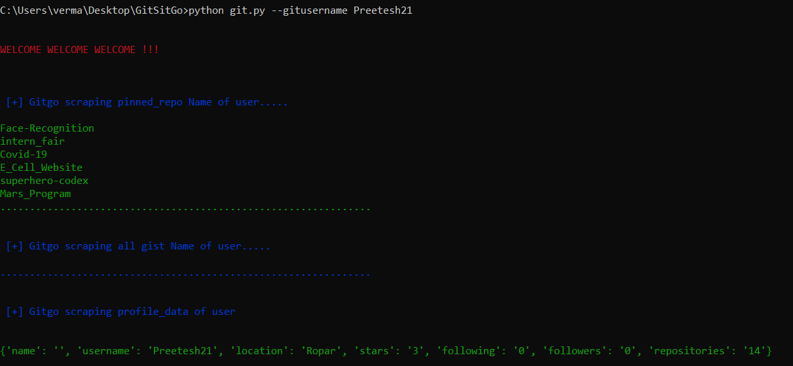

# GitSitGo
Attempt at builiding a command line web scrapper in python.
The Scrapper here takes the github username of the persone and returns the various details regarding his overview page such as his pinned Repositories and his bio-data.
Corner Cases have been handled.
Here is a preivew of the same.

